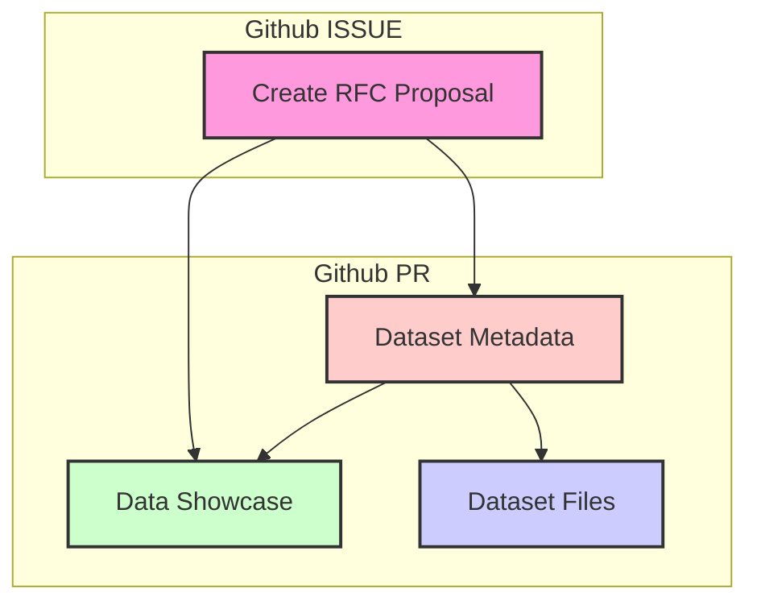

## Contribution Guide

### Adding a new dataset

To contribute a new dataset to the Graph Dataset Hub, please follow these steps:



**RFC Proposal**: Before adding a new dataset, create a [RFC Proposal](https://github.com/wey-gu/awesome-graph-dataset/issues/new?assignees=&labels=RFC&template=rfc.md&title=%5BRFC%5D%20Dataset%20Name%20%28%20%29) detailing the dataset you wish to add. This allows for discussion and collabration before moving forward.

[RFC Proposal](https://github.com/wey-gu/awesome-graph-dataset/issues){ .md-button .md-button--secondary }

**Dataset Introduction**: Once the issue is approved, you can proceed with introducing the dataset by following the steps outlined below.

- Create a folder in the `datasets` directory with the id of the dataset.
- Add a `metadata.yaml` file in the dataset folder.
  - For demo video, consider using NebulaGraph Explorer, Gephi, or other visualization tools(like the `%ng_draw` in Jupyter-NebulaGraph).
  - For iframe(html version of Graph Visualization), consider using [NebulaGraph-Gephi](https://github.com/wey-gu/NebulaGraph-Gephi) to Query and Render a HTML file.
- Add a `schema.ddl.ngql` file in the dataset folder.
- Add `nav` in the `mkdocs.yml` file, in alphabetical order.
- Add dataset CSV files in the dataset folder, with git LFS enabled, at least the tiny profile.


### Build Graph Hub Site locally

Install git-lfs.

```bash
sudo apt-get install git-lfs
git lfs install
```

Install the required packages and build the site.

```bash
# Install the required packages
pip3 install -r docs/requirements.txt
# Build the site
export WITH_GITLFS=true ;python3 build.py
# Serve the site
mkdocs serve -a 0.0.0.0:8088
```

### Example of introducing a new dataset

```bash
$ git add .
# datafiles, metadata, schema, and mkdocs.yml were modified
$ git status
On branch movie_recommendation
Changes to be committed:
  (use "git restore --staged <file>..." to unstage)
        new file:   datasets/movie_recommendation/metadata.yaml
        new file:   datasets/movie_recommendation/schema.ddl.ngql
        new file:   datasets/movie_recommendation/small/acted_by.csv
        new file:   datasets/movie_recommendation/small/acted_by.ngql
        new file:   datasets/movie_recommendation/small/directed_by.csv
        new file:   datasets/movie_recommendation/small/directed_by.ngql
        new file:   datasets/movie_recommendation/small/genres.csv
        new file:   datasets/movie_recommendation/small/genres.ngql
        new file:   datasets/movie_recommendation/small/movies.csv
        new file:   datasets/movie_recommendation/small/movies.ngql
        new file:   datasets/movie_recommendation/small/people.csv
        new file:   datasets/movie_recommendation/small/people.ngql
        new file:   datasets/movie_recommendation/small/user.ngql
        new file:   datasets/movie_recommendation/small/user_watched_movies.csv
        new file:   datasets/movie_recommendation/small/user_watched_movies.ngql
        new file:   datasets/movie_recommendation/small/with_genre.csv
        new file:   datasets/movie_recommendation/small/with_genre.ngql
        new file:   datasets/movie_recommendation/to_ngql.py
        modified:   mkdocs.yml

# check git-lfs status, that all data file(s) are tracked by git-lfs
$ git lfs status
On branch movie_recommendation

Objects to be committed:

        datasets/movie_recommendation/metadata.yaml (Git: 4e748db)
        datasets/movie_recommendation/schema.ddl.ngql (Git: 61b9d8d)
        datasets/movie_recommendation/small/acted_by.csv (LFS: 64cf649)
        datasets/movie_recommendation/small/acted_by.data.ngql (LFS: 579455d)
        datasets/movie_recommendation/small/directed_by.csv (LFS: 7ce4ebd)
        datasets/movie_recommendation/small/directed_by.data.ngql (LFS: 6e8946b)
        datasets/movie_recommendation/small/genres.csv (LFS: 75b6a31)
        datasets/movie_recommendation/small/genres.data.ngql (LFS: 9e253c4)
        datasets/movie_recommendation/small/movies.csv (LFS: cf95196)
        datasets/movie_recommendation/small/movies.data.ngql (LFS: 1f1b02b)
        datasets/movie_recommendation/small/people.csv (LFS: cb0d0f5)
        datasets/movie_recommendation/small/people.data.ngql (LFS: a387254)
        datasets/movie_recommendation/small/user.data.ngql (LFS: b574c4a)
        datasets/movie_recommendation/small/user_watched_movies.csv (LFS: 2cb8e9c)
        datasets/movie_recommendation/small/user_watched_movies.data.ngql (LFS: da0ea42)
        datasets/movie_recommendation/small/with_genre.csv (LFS: 34cdd47)
        datasets/movie_recommendation/small/with_genre.data.ngql (LFS: 08b47b9)
        datasets/movie_recommendation/to_ngql.py (Git: b665eb1)
        mkdocs.yml (Git: 1e26846 -> Git: 34964e2)

Objects not staged for commit:
```

Then try to build the site locally and check the new dataset.

```bash
$ export WITH_GITLFS=true ;python3 build.py
$ mkdocs serve -a 0.0.0.0:8088
```

And visit the site at `http://localhost:8088` and verify the new dataset's page.
