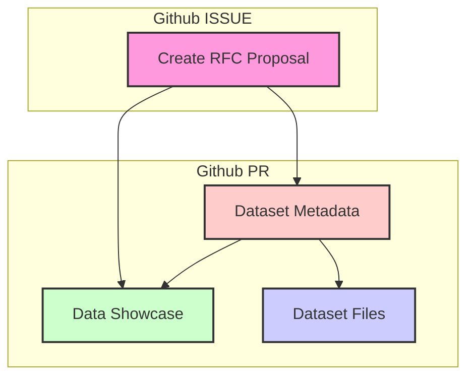

## Contribution Guide

### Adding a new dataset

To contribute a new dataset to the Graph Dataset Hub, please follow these steps:



**RFC Proposal**: Before adding a new dataset, create a [RFC Proposal](https://github.com/wey-gu/awesome-graph-dataset/issues/new?assignees=&labels=RFC&template=rfc.md&title=%5BRFC%5D%20Dataset%20Name%20%28%20%29) detailing the dataset you wish to add. This allows for discussion and collabration before moving forward.

[RFC Proposal](https://github.com/wey-gu/awesome-graph-dataset/issues){ .md-button .md-button--secondary }

**Dataset Introduction**: Once the issue is approved, you can proceed with introducing the dataset by following the steps outlined below.

- Create a folder in the `datasets` directory with the id of the dataset.
- Add a `metadata.yaml` file in the dataset folder.
  - For demo video, consider using NebulaGraph Explorer, Gephi, or other visualization tools(like the `%ng_draw` in Jupyter-NebulaGraph).
  - For iframe(html version of Graph Visualization), consider using [NebulaGraph-Gephi](https://github.com/wey-gu/NebulaGraph-Gephi) to Query and Render a HTML file.
- Add a `schema.ddl.ngql` file in the dataset folder.
- Add `nav` in the `mkdocs.yml` file, in alphabetical order.
- Add dataset CSV files in the dataset folder, with git LFS enabled, at least the tiny profile.


### Build Graph Hub Site locally

Install git-lfs.

```bash
sudo apt-get install git-lfs
git lfs install
```

Install the required packages and build the site.

```bash
# Install the required packages
pip3 install -r docs/requirements.txt
# Build the site
export WITH_GITLFS=true ;python3 build.py
# Serve the site
mkdocs serve -a 0.0.0.0:8088
```
