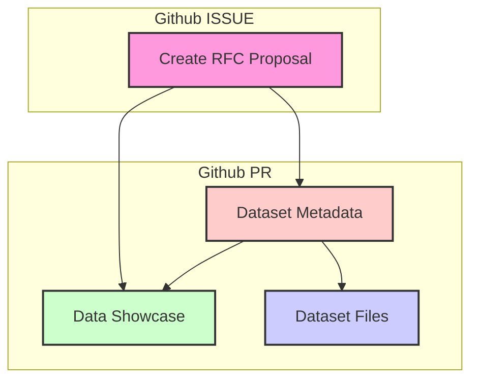
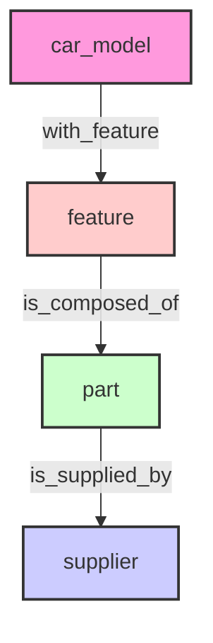

## Contribution Guide

### Adding a new dataset

To contribute a new dataset to the Graph Dataset Hub, please follow these steps:



**RFC Proposal**: Before adding a new dataset, create a [RFC Proposal](https://github.com/wey-gu/awesome-graph-dataset/issues/new?assignees=&labels=RFC&template=rfc.md&title=%5BRFC%5D%20Dataset%20Name%20%28%20%29) detailing the dataset you wish to add. This allows for discussion and collabration before moving forward.

[RFC Proposal](https://github.com/wey-gu/awesome-graph-dataset/issues){ .md-button .md-button--secondary }

**Dataset Introduction**: Once the issue is approved, you can proceed with introducing the dataset by following the steps outlined below.

- Create a folder in the `datasets` directory with the id of the dataset.
- Add a `metadata.yaml` file in the dataset folder.
  - For demo video, consider using NebulaGraph Explorer, Gephi, or other visualization tools(like the `%ng_draw` in Jupyter-NebulaGraph).
  - For iframe(html version of Graph Visualization), consider using [NebulaGraph-Gephi](https://github.com/wey-gu/NebulaGraph-Gephi) to Query and Render a HTML file.
- Add a `schema.ddl.ngql` file in the dataset folder.
- Add `nav` in the `mkdocs.yml` file, in alphabetical order.
- Add dataset CSV files in the dataset folder, with git LFS enabled, at least the tiny profile.


### Build Graph Hub Site locally

Install git-lfs.

```bash
sudo apt-get install git-lfs
git lfs install
```

Install the required packages and build the site.

```bash
# Install the required packages
pip3 install -r docs/requirements.txt
# Build the site
export WITH_GITLFS=true ;python3 build_site.py
# Serve the site
mkdocs serve -a 0.0.0.0:8088
```

### Example of PR and Git Flow and File Handling

> Assuming that you have already created a proposal issue and it has been discussed by the community.

Reference PR: [#10](https://github.com/wey-gu/awesome-graph-dataset/pull/10)

First, create a new folder in the `datasets` directory with the id of the dataset.

```bash
$ git add .
# datafiles, metadata, schema, and mkdocs.yml were modified
$ git status
On branch movie_recommendation
Changes to be committed:
  (use "git restore --staged <file>..." to unstage)
        new file:   datasets/movie_recommendation/metadata.yaml
        new file:   datasets/movie_recommendation/schema.ddl.ngql
        new file:   datasets/movie_recommendation/small/acted_by.csv
        new file:   datasets/movie_recommendation/small/acted_by.ngql
        new file:   datasets/movie_recommendation/small/directed_by.csv
        new file:   datasets/movie_recommendation/small/directed_by.ngql
        new file:   datasets/movie_recommendation/small/genres.csv
        new file:   datasets/movie_recommendation/small/genres.ngql
        new file:   datasets/movie_recommendation/small/movies.csv
        new file:   datasets/movie_recommendation/small/movies.ngql
        new file:   datasets/movie_recommendation/small/people.csv
        new file:   datasets/movie_recommendation/small/people.ngql
        new file:   datasets/movie_recommendation/small/user.ngql
        new file:   datasets/movie_recommendation/small/user_watched_movies.csv
        new file:   datasets/movie_recommendation/small/user_watched_movies.ngql
        new file:   datasets/movie_recommendation/small/with_genre.csv
        new file:   datasets/movie_recommendation/small/with_genre.ngql
        new file:   datasets/movie_recommendation/to_ngql.py
        modified:   mkdocs.yml

# check git-lfs status, that all data file(s) are tracked by git-lfs
$ git lfs status
On branch movie_recommendation

Objects to be committed:

        datasets/movie_recommendation/metadata.yaml (Git: 4e748db)
        datasets/movie_recommendation/schema.ddl.ngql (Git: 61b9d8d)
        datasets/movie_recommendation/small/acted_by.csv (LFS: 64cf649)
        datasets/movie_recommendation/small/acted_by.data.ngql (LFS: 579455d)
        datasets/movie_recommendation/small/directed_by.csv (LFS: 7ce4ebd)
        datasets/movie_recommendation/small/directed_by.data.ngql (LFS: 6e8946b)
        datasets/movie_recommendation/small/genres.csv (LFS: 75b6a31)
        datasets/movie_recommendation/small/genres.data.ngql (LFS: 9e253c4)
        datasets/movie_recommendation/small/movies.csv (LFS: cf95196)
        datasets/movie_recommendation/small/movies.data.ngql (LFS: 1f1b02b)
        datasets/movie_recommendation/small/people.csv (LFS: cb0d0f5)
        datasets/movie_recommendation/small/people.data.ngql (LFS: a387254)
        datasets/movie_recommendation/small/user.data.ngql (LFS: b574c4a)
        datasets/movie_recommendation/small/user_watched_movies.csv (LFS: 2cb8e9c)
        datasets/movie_recommendation/small/user_watched_movies.data.ngql (LFS: da0ea42)
        datasets/movie_recommendation/small/with_genre.csv (LFS: 34cdd47)
        datasets/movie_recommendation/small/with_genre.data.ngql (LFS: 08b47b9)
        datasets/movie_recommendation/to_ngql.py (Git: b665eb1)
        mkdocs.yml (Git: 1e26846 -> Git: 34964e2)

Objects not staged for commit:
```

Then try to build the site locally and check the new dataset.

```bash
$ export WITH_GITLFS=true ;python3 build_site.py
$ mkdocs serve -a 0.0.0.0:8088
```

And visit the site at `http://localhost:8088` and verify the new dataset's page.

Then we could push the changes to the repository and create a PR!

### Example of Jupyter-NebulaGraph `%ng_load` lines:

This is to prepare values under `jupyter_nebulagraph_load_lines` in the `metadata.yaml` file.

#### Option 0: generate the `%ng_load` lines from Nebula Importer config

> Note: the v4 version(Config Version:v3) of Nebula Importer is not supported yet.

You could just call `tools/importer_v3_to_ng_load_lines.py <path_or_url_to_nebula_importer_config>` to generate the `%ng_load` lines, like:

```bash
$ python tools/importer_v3_to_ng_load_lines.py https://raw.githubusercontent.com/wey-gu/nebula-shareholding-example/main/nebula-importer.yaml

YAML file: https://raw.githubusercontent.com/wey-gu/nebula-shareholding-example/main/nebula-importer.yaml

Parsed %ng_load lines:
Warn: edge: is_branch_of is propless
%ng_load  --source ./person.csv --tag person --vid 0 --props 1:name --space shareholding
%ng_load  --source ./corp.csv --tag corp --vid 0 --props 1:name --space shareholding
%ng_load  --source ./person_corp_role.csv --edge role_as --src 0 --dst 1 --props 2:role  --space shareholding
%ng_load  --source ./corp_rel.csv --edge is_branch_of --src 0 --dst 1   --space shareholding
%ng_load  --source ./corp_share.csv --edge hold_share --src 0 --dst 1 --props 2:share  --space shareholding
%ng_load  --source ./person_corp_share.csv --edge hold_share --src 0 --dst 1 --props 2:share  --space shareholding
%ng_load  --source ./person_rel.csv --edge reletive_with --src 0 --dst 1 --props 2:degree  --space shareholding
```

#### Option 1: write following docs of `%ng_load`

Basically we just need to compose the lines to map CSV columns to the edge or tag(vertex) schema.

See [here](https://jupyter-nebulagraph.readthedocs.io/en/stable/magic_words/ng_load/) for more details.

For example, to load data from a CSV file actor.csv into a space basketballplayer with tag player and vid in column 0, and props in column 1 and 2:

```csv
player_id,name,age
"player999","Tom Hanks",30
"player1000","Tom Cruise",40
"player1001","Jimmy X",33
```

Then the `%ng_load` line would be:

```ascii
%ng_load --header --source actor.csv --tag player --vid 0 --props 1:name,2:age --space basketballplayer
         ────┬─── ────┬───────────── ─────┬────── ───┬─── ─────────┬────────── ────────────┬───────────
             │        │                   │          │             │                       │           
             │        │                   │          │             │                       │           
             │        │                   │          │             │                       │           
             │        │                   │          │             │                       │           
             │        │                   │          │             │                       │           
             │        │                   │          │             │                       │           
             │        │  ┌────────────────┘          │             │                 ┌────────────────┐
             │        │  │                           │             │                 │Graph Space Name│
             │        │  │            ┌──────────────┘             │                 └────────────────┘
             │        │  │            │    ┌──────────────────────────────────────────────────────────┐
             │        │  │            │    │Properties on <column_index>:<prop_name> if there are any.│
             │        │  │            │    └──────────────────────────────────────────────────────────┘
             │        │  │   ┌────────┴───────────────────────────────────────────────────────────────┐
             │        │  │   │                              For tag, there will be column index of VID│
             │        │  │   │ For edge, there will be src/dst VID index, or optionally the rank index│
             │        │  │   └────────────────────────────────────────────────────────────────────────┘
             │        │  │                                                    ┌───────────────────────┐
             │        │  └────────────────────────────────────────────────────┤vertex tag or edge type│
             │        │                                                       └───────────────────────┘
             │        │                                                  ┌────────────────────────────┐
             │        └──────────────────────────────────────────────────┤File to parse, a path or URL│
             │                                                           └────────────────────────────┘
             │                                                         ┌──────────────────────────────┐
             └─────────────────────────────────────────────────────────┤With Header in Row:0, Optional│
                                                                       └──────────────────────────────┘
```

### Prepare for Data Showcase

In `metadata.yaml`, you could add the following fields to showcase the dataset:

```yaml
video: https://github.com/wey-gu/supplychain-dataset-gen/assets/1651790/efb9d71a-4ed6-4272-a976-d4f922cf829a
iframe: https://www.siwei.io/demo-dumps/adhoc-graphs/nebulagraph_export_supply_chain.html
screen_capture: https://github.com/wey-gu/supplychain-dataset-gen/assets/1651790/73d88e8f-ad20-4657-8323-97ec38f4b667
gephi_lite_file: https://siwei.io/demo-dumps/adhoc-graphs/nebulagraph_export_supply_chain.gexf
```

But how could we prepare these files? Don't worry, we have some tools to help you!

#### With NebulaGraph-Gephi

[NebulaGraph-Gephi](https://github.com/wey-gu/NebulaGraph-Gephi) is a tool to help you:

- Query NebulaGraph data and export to Gephi(.gexf) file, which could be used in Gephi or other visualization tools.
- Query NebulaGraph data and export to Single HTML file with `iframe` tag.
- To record a video of the graph visualization.


<iframe width="100%" height="420" src="https://github.com/siwei-io/talks/assets/1651790/c036a229-c71e-4344-93d4-720657f2ba90" frameborder="0" allowfullscreen></iframe>

#### With Jupyter-NebulaGraph

[Jupyter-NebulaGraph](https://jupyter-nebulagraph.readthedocs.io/en/stable/) is a tool to help you:

- Query NebulaGraph data and visualize (with `%ng_draw`) in Jupyter Notebook, there will be a `nebulagraph.html` file generated in your notebook folder.
- Draw Schema Visualization with `%ng_draw_schema` magic, there will be a `nebulagraph_schema.html` file generated in your notebook folder.
- To record a video of the graph data and schema visualization.

### Prepare for Schema Diagram

We are using ASCII Schema Diagram powerred by Mermaid. Don't be afraid, they are optional and yet really easy to tweak with the [live render tooling of Mermaid](https://mermaid.live/).

For example, you could copy the structure_mermaid field into the live render tooling and tweak it:
```yaml
# the following part
structure_mermaid: |
  graph TD
    A[car_model]
    B[feature]
    C[part]
    D[supplier]

    A -->|with_feature| B
    B -->|is_composed_of| C
    C -->|is_supplied_by| D

    style A fill:#f9d,stroke:#333,stroke-width:2px;
    style B fill:#fcc,stroke:#333,stroke-width:2px;
    style C fill:#cfc,stroke:#333,stroke-width:2px;
    style D fill:#ccf,stroke:#333,stroke-width:2px;
properties_mermaid: |
  classDiagram
    class car_model {
        string name
        string number
        int year
        string type
        string engine_type
        string size
        int seats
    }
    class feature {
        string name
        string number
        string type
        string state
    }
    class part {
        string name
        string number
        double price
        string date
    }
    class supplier {
        string name
        string address
        string contact
        string phone_number
    }

    car_model --> feature : with_feature
    feature --> part : is_composed_of
    part --> supplier : is_supplied_by

    style car_model fill:#f9d,stroke:#333,stroke-width:2px;
    style feature fill:#fcc,stroke:#333,stroke-width:2px;
    style part fill:#cfc,stroke:#333,stroke-width:2px;
    style supplier fill:#ccf,stroke:#333,stroke-width:2px;
```

```
  graph TD
    A[car_model]
    B[feature]
    C[part]
    D[supplier]

    A -->|with_feature| B
    B -->|is_composed_of| C
    C -->|is_supplied_by| D

    style A fill:#f9d,stroke:#333,stroke-width:2px;
    style B fill:#fcc,stroke:#333,stroke-width:2px;
    style C fill:#cfc,stroke:#333,stroke-width:2px;
    style D fill:#ccf,stroke:#333,stroke-width:2px;
```

And it'll look like this in the live render tooling:



Try modifying the `structure_mermaid` and `properties_mermaid` fields in the `metadata.yaml` file to see how it affects the schema diagram.

See also what a properties_mermaid looks like in the live render tooling:


