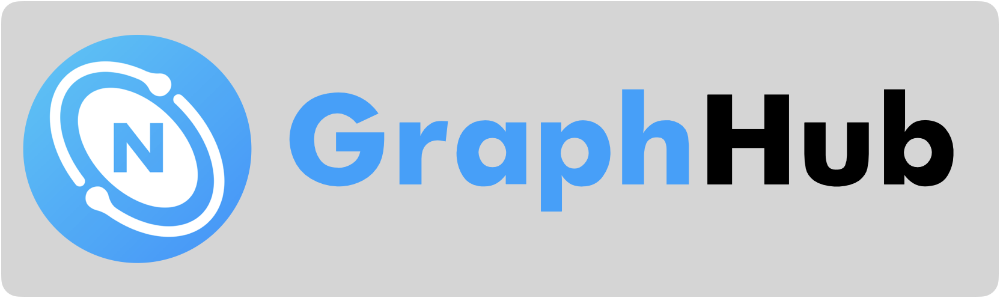

[Graph Hub](https://graph-hub.siwei.io) serves as a vibrant community and platform, offering a curated collection of graph datasets specifically designed for NebulaGraph.

## Discover [Graph Hub](https://graph-hub.siwei.io)

Greetings to all graph enthusiasts! 🌐

Graph Hub stands as an extensive repository of graph datasets, primed for integration with NebulaGraph. Whether you are a data scientist, a researcher, or simply fascinated by graphs, our hub offers a diverse array of datasets across various domains and sizes, meticulously curated to meet your requirements.

Dive into our collection, master the process of loading them into NebulaGraph, and kickstart the development of your graph-based applications today!

Interested in contributing or learning more about our datasets? Head over to our [GitHub repository](https://github.com/wey-gu/awesome-graph-dataset). We are always excited to welcome new contributions from our community!

For direct access to our datasets, navigate to the [datasets directory](datasets/index.md). Here, you will encounter a broad selection of graph datasets, each carefully prepared to ensure full compatibility with NebulaGraph, thus guaranteeing a smooth and efficient experience as you venture into the realm of graph databases.
